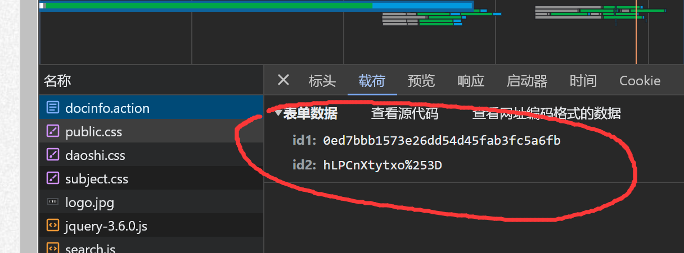

# 查看chrome版本
浏览器输入 chrome://version

# 下载driver
#### 老版本chrome
http://chromedriver.storage.googleapis.com/index.html
#### test chrome
https://googlechromelabs.github.io/chrome-for-testing/

# 添加环境变量
下载win32.exe丢到C:\Windows\System32

# 执行代码
替换thsis_url变量，执行
替换方法
https://thesis.lib.pku.edu.cn/docinfo.action?id1={{RESPONSE.id1}}&id2={{RESPONSE.id2}}
